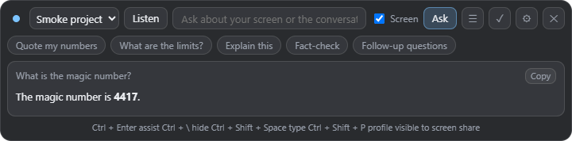

# Sotto

An open-source desktop assistant that floats over your screen. It can see what you see, hear what you hear, and answer from your own files. You bring your own API key, and nothing goes anywhere except to the model provider you choose.

*Sotto voce*: said quietly, for one listener.



## What it does

| Feature | How it works |
| --- | --- |
| Overlay | A small always-on-top bar. Frameless, translucent, movable, never takes the taskbar. |
| Hidden from capture | The overlay is excluded from screen sharing and recordings (on by default, one switch to turn off). |
| Sees your screen | Each question can carry a screenshot of the display the overlay is on. |
| Hears the meeting | Captures your microphone and the computer's audio as two separate speakers, "Me" and "Them". |
| Live transcript | Streaming speech to text with Deepgram, or chunked Whisper through any OpenAI-compatible server. |
| Live suggestions | When the other side asks a question, a fast model drafts what you could say. |
| One-key assist | A global hotkey asks "help with what is on screen" from inside any app. |
| Quick actions | Chips such as "What should I say?", "Fact-check", "Find the bug", "Safety check", "Quote my numbers". They change with the profile. |
| Chat | Type a question, get a streamed answer, ask follow-ups. Recent turns are remembered within the session. |
| Your files | Add notes, papers, datasheets, PDFs, Word files or code. Small sets are sent whole. Large sets are searched (BM25) and only the best passages are sent. |
| Profiles | Seven built-in work types, your own custom profiles, and project packs. Switch with a hotkey. |
| Session notes | End a session and get a title, summary, decisions, action items, open questions and a follow-up email draft. |
| History | Every session is saved locally with notes, chat and transcript. Export any of them to Markdown. |
| Click-through | A hotkey makes the overlay ignore the mouse so you can work underneath it. |
| Any model | Anthropic Claude, or any OpenAI-compatible endpoint: OpenAI, Groq, OpenRouter, or a local Ollama. |

## Install and run

You need [Node.js](https://nodejs.org) 20 or newer.

```
git clone https://github.com/bakathefish/sotto.git
cd sotto
npm install
npm start
```

The overlay appears at the top of the screen. Press the gear button (or `Ctrl+Shift+D`) to open the dashboard, go to Settings, and paste an API key.

To build an installer for your platform: `npm run dist`.

## Keys

Sotto has no account and no server. You paste your own keys into the dashboard.

| Key | Needed for | Where to get it |
| --- | --- | --- |
| Anthropic | Answers with Claude | console.anthropic.com |
| OpenAI-compatible | Answers with OpenAI, Groq, OpenRouter. Not needed for a local Ollama. | Your provider |
| Deepgram | Live streaming transcription | console.deepgram.com |

Keys are encrypted with the operating system keychain (Electron `safeStorage`) and kept in the app's settings folder. The window code never receives a key back, only whether one is saved.

To run fully local, choose the OpenAI-compatible provider, set the base URL to `http://localhost:11434/v1`, pick a vision model you have pulled in Ollama, and leave the key blank.

## Shortcuts

All of them work from any app and can be changed in the dashboard. `Ctrl` is `Cmd` on macOS.

| Shortcut | Action |
| --- | --- |
| `Ctrl+Enter` | Assist with what is on screen |
| `Ctrl+\` | Show or hide the overlay |
| `Ctrl+Shift+Space` | Type a question |
| `Ctrl+Shift+L` | Start or stop listening |
| `Ctrl+Shift+P` | Next profile |
| `Ctrl+Shift+X` | Click-through on or off |
| `Ctrl+Shift+R` | Start a new session |
| `Ctrl+Shift+D` | Open the dashboard |
| `Ctrl+Alt+Arrow` | Move the overlay |

## Profiles

A profile is a set of instructions, a set of quick actions and a set of files. The built-in ones cover different kinds of work:

| Profile | Tuned for |
| --- | --- |
| General | Everyday help with whatever is on screen |
| Meeting | Calls and interviews: what to say next, recap, follow-up email |
| Research | Presenting or defending your own work: exact numbers, stated limits, no overclaiming |
| Coding | Reading errors, finding the bug, reviewing a diff |
| Hardware | Bring-up and debugging: next measurement, safety check, datasheet facts |
| School | Studying: hints before answers, quizzes, explanations |
| Business | Sales and negotiation: objections, numbers, follow-ups |

Every profile shares one rule that matters: for anything about your own work, the assistant uses only your files, and says so when the answer is not in them. General background is allowed but has to be labelled as such.

Make your own profile in the dashboard with **New profile**, then add files to it.

## Project packs

A pack is a folder you can import in one click. It becomes a profile that carries its own files. Use one per project so the right knowledge follows the right work.

```
my-project/
  sotto-pack.json
  01_overview.md
  02_numbers.md
```

```json
{
  "name": "My project",
  "mode": "research",
  "description": "One line about what this is.",
  "prompt": "Extra instructions for this project. The numbers in 02_numbers.md are the only ones to quote.",
  "files": ["01_overview.md", "02_numbers.md"]
}
```

`mode` is one of `general`, `meeting`, `research`, `coding`, `hardware`, `school`, `business`. The pack inherits that work type's instructions and quick actions and adds its own `prompt` on top. File paths must be relative to the pack folder.

In the dashboard, **Import pack** accepts one pack folder or a folder full of pack folders. A working example is in [`examples/example-pack`](examples/example-pack).

## How it is built

Electron, plain JavaScript, no bundler and no framework. Two direct runtime dependencies, both for reading documents (`pdf-parse`, `mammoth`).

```
src/core       Pure logic with no Electron in it: prompts, profiles, retrieval,
               transcript, stream parsing, markdown. Fully unit tested.
src/main       The Electron main process: windows, hotkeys, screen capture,
               model calls, speech to text, settings, sessions.
src/renderer   The overlay and the dashboard. Sandboxed, context-isolated,
               and limited to a fixed list of IPC channels.
test           Unit tests and an end-to-end smoke test.
```

```
npm test         Unit tests (Node's built-in test runner)
npm run smoke    Launches the real app against a local mock model server and
                 checks a question, a screenshot, a pack, streaming and notes
```

## Privacy

- There is no telemetry and no Sotto server.
- Screenshots, transcript text and the passages of your files go to the model provider you picked, and audio goes to the transcription provider you picked, only when you ask a question or turn listening on.
- Settings, keys and sessions stay in the app's user data folder on your computer.

## Use it responsibly

Sotto can listen to other people and can hide itself from a shared screen. That puts the responsibility on you.

- Tell people when you are recording or transcribing them. Many places require the consent of everyone on the call.
- Do not use it where outside help is not allowed, such as exams, graded work, or interviews and competitions with rules against it.
- It is an aid for your own notes, your own work and your own understanding. It is not a way to pass off answers you do not understand.

## Platform notes

- **Windows**: everything works, including system audio.
- **macOS**: grant Screen Recording and Microphone permission on first use. Whether system audio can be captured depends on the macOS and Electron versions. If it cannot, Sotto says so and listens to the microphone only.
- **Linux**: system audio capture and hiding from screen capture are not available on every desktop. Sotto falls back to the microphone.

Developed and tested on Windows 11. The macOS and Linux paths use the same Electron APIs but have not been tested by the author.

## Licence

MIT. See [LICENSE](LICENSE).

Sotto is an independent project. It is not affiliated with, and shares no code with, any commercial product.
